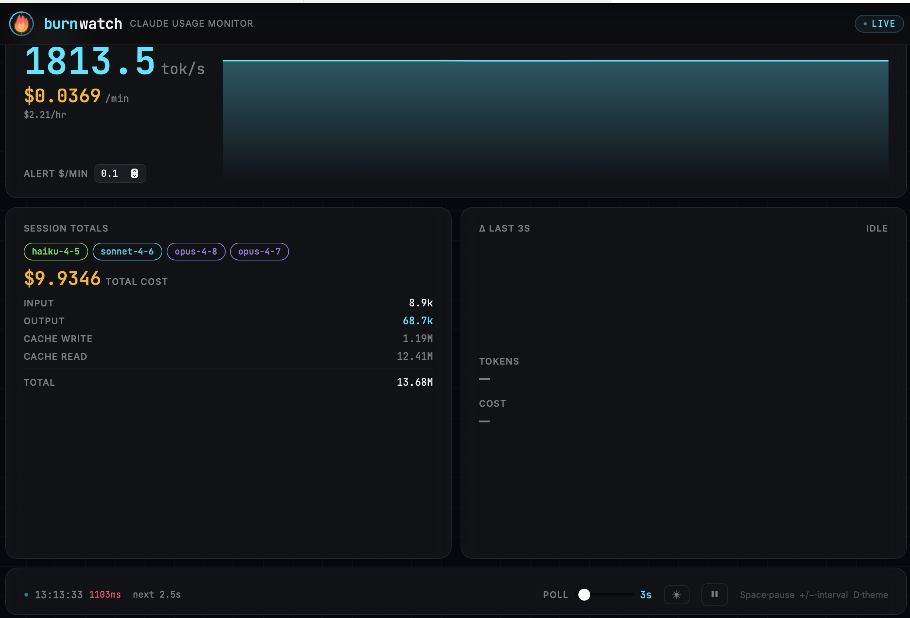

# BurnWatch



**Real-time Claude token burn rate dashboard.** Know exactly how fast you're spending — before the bill does.

BurnWatch polls `ccusage` and surfaces your active session's burn rate, cost per hour, token velocity, and a live sparkline — all in a clean dark-mode UI that stays out of your way.

---

## Features

- **Live burn rate** — tokens/min and $/hr updated every few seconds
- **Sparkline chart** — visualise token velocity over time at a glance
- **Session totals** — input, output, cache creation, and cache read tokens broken down
- **Cost tracking** — running USD cost for the active session
- **Threshold alerts** — toast notifications when burn rate spikes
- **Keyboard-first** — pause, adjust polling speed, and toggle dark mode without touching the mouse

---

## Prerequisites

- Node.js 18+
- [`ccusage`](https://github.com/ryoppippi/ccusage) installed globally:

```bash
npm i -g ccusage
```

---

## Quick Start

```bash
./burn.sh install    # install npm deps + ccusage
./burn.sh link       # symlink 'burn' into /usr/local/bin (run once)
```

After linking, use `burn` from any terminal:

```bash
burn start           # launch dashboard in background → http://localhost:5777
burn dev             # launch in foreground with live logs
burn stop            # stop the dashboard
burn restart         # stop then start in background
burn build           # production build (output in dist/)
burn uninstall       # remove symlink and node_modules
```

---

## Keyboard Shortcuts

| Key | Action |
|-----|--------|
| `Space` | Pause / resume polling |
| `+` / `-` | Increase / decrease poll interval |
| `D` | Toggle dark / light mode |

---

## How It Works

BurnWatch runs a lightweight Express proxy that shells out to `ccusage blocks --active --json` and normalises the response. The React frontend polls the proxy and renders everything live — no database, no auth, no config.

Expected shape from `ccusage`:

```json
{
  "blocks": [{
    "isActive": true,
    "costUSD": 1.23,
    "totalTokens": 500000,
    "tokenCounts": {
      "inputTokens": 10000,
      "outputTokens": 5000,
      "cacheCreationInputTokens": 200000,
      "cacheReadInputTokens": 285000
    },
    "models": ["claude-sonnet-4-6"],
    "burnRate": {
      "costPerHour": 2.5,
      "tokensPerMinute": 8000,
      "tokensPerMinuteForIndicator": 133.3
    }
  }]
}
```

If your version of `ccusage` returns a different shape, adjust `normaliseBlock()` in `proxy/server.js`.

---

## Stack

- **React 19** + **Vite 6** — frontend
- **Recharts** — sparkline visualisation
- **Express** — local proxy for `ccusage`
- **react-hot-toast** — burn rate alerts
